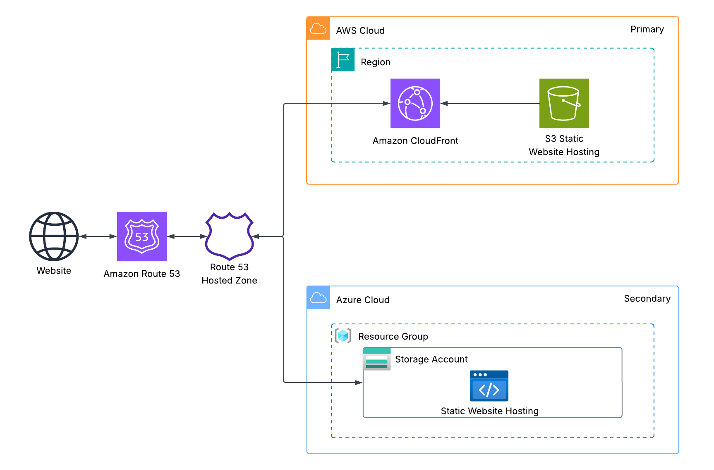
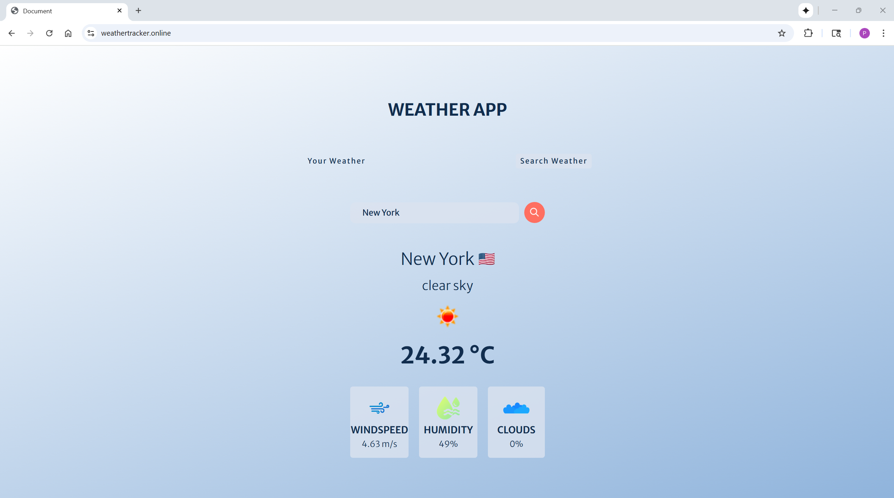

# AWS/Azure DR Weather Tracker Website
A multi-cloud, static **Weather Tracker** website deployed to **AWS (primary)** with **manual DNS failover** to **Azure (secondary)**. The app is fronted by **Amazon CloudFront** for HTTPS and performance. In a DR scenario, DNS shifts traffic to an **Azure Storage Static Website** endpoint served over **HTTP** (by design for this project’s cost constraints).  

> **Production note:** For HTTPS on Azure during failover, use **Azure Front Door** or Azure CDN with managed TLS.  

## Architecture Overview
  
*Figure 1: Architecture diagram of the AWS/Azure DR Weather Tracker Website.*  

#### AWS
- **Amazon S3 (Static Website):** Hosts `index.html`, `styles.css`, `script.js`, and asset files using the S3 website endpoint.  
- **Amazon CloudFront:** Global CDN in front of the S3 website endpoint with TLS; HSTS intentionally omitted to allow HTTP-based DR.  
- **Amazon Route 53:** Public DNS with **weighted CNAME** records on `www` for manual failover/fail back between AWS and Azure; also publishes the `asverify` CNAME for Azure validation.  
- **AWS Certificate Manager (ACM):** TLS certificate for `www.<domain>` issued in **us-east-1** for CloudFront.  

#### Azure
- **Azure Resource Group:** Logical container for DR resources.  
- **Azure Storage Account (Static Website):** `$web` container serves the same site files; custom domain mapping is validated via `asverify` and re-applied on each Terraform run; HTTP is allowed for DR to keep costs down (no Front Door).  

## Skills Applied
- Designing a **multi-cloud DR** pattern using weighted **DNS** to shift traffic between providers.  
- Authoring **Terraform** for AWS and Azure resources, variables, and reusable locals.  
- Implementing **CloudFront** with a **custom origin** (S3 website endpoint) and **no HSTS** headers to enable HTTP DR.  
- Configuring **Azure Static Website** with **custom domain** mapping via **asverify** CNAME validation.  
- Automating cross-cloud **asset uploads** and **content types** for static assets.  
- Orchestrating **manual failover** and **fail back** using Terraform variables (record weights).  

## Features
- **Primary on AWS:** Fast, global delivery via CloudFront with HTTPS.  
- **Manual DR Toggle:** Route 53 weighted records switch traffic to Azure (and back).  
- **Zero-downtime content updates:** Terraform syncs files; CloudFront handles caching.  
- **Cost-aware Failover:** Azure DR serves **HTTP** only (no Front Door), documented trade-off.   
- **Custom Domain on Azure:** Validated via **asverify** CNAME for clean host header handling.  

## Tech Stack
- **Languages:** HTML, CSS, JavaScript  
- **AWS Services:** S3 (Website), CloudFront, Route 53, ACM  
- **Azure Services:** Resource Group, Storage (Static Website)  
- **IaC Tool:** Terraform (AWS + Azure providers)  
- **Other Tools:** AWS CLI, Azure CLI (`az`), Namecheap (domain registrar)  

## Deployment Instructions
> **Note:** All command-line examples use `bash` syntax highlighting to maximize compatibility and readability. If you are using PowerShell or Command Prompt on Windows, the commands remain the same but prompt styles may differ.  

### Domain Name and Certificate
1. Purchase a domain (Namecheap used here) and create a **Public hosted zone** for it in Route 53.  

2. In your registrar, set the domain’s **nameservers** to the 4 NS values from your Route 53 hosted zone.  

3. Request an **ACM certificate** in **us-east-1** for:  
   - `www.<domain>` (required for CloudFront)
   - `<domain>` (apex, optional if you’ll later add an apex → www redirect)

4. Choose **DNS validation** and click **Create records in Route 53** on the certificate to add the validation CNAMEs.  

5. Wait until the certificate shows **Issued**.  

### Azure Configuration
6.  Run `az login` and select a Subscription ID to deploy resources.  

7. Register an application in Azure Entra ID:  
	```bash
    `az ad sp create-for-rbac --role="Contributor" --scopes="/subscriptions/<subscription-id>"
	```

### **Terraform** 
8. Clone this repository.  

9. Edit variables in `terraform.tfvars` and/or `variables.tf` to customize the deployment.  

10. Navigate to the `terraform` folder and deploy:  
   ```bash
   cd terraform
   terraform init
   terraform plan # Optional, but recommended.
   terraform apply
   ```  

11. **To manually toggle DR (Azure)**:
    - In `terraform.tfvars`, set:
      ```hcl
      primary_weight = "0"
      secondary_weight = "100"
      ```
    - Apply:
      ```bash
      terraform apply
      ```
    - After ~60s DNS TTL, visit **`http://www.<your-domain>/`** (HTTP on DR is expected).  

12. **To fail back (AWS)**:
    - In `terraform.tfvars`, set:
      ```hcl
      primary_weight = "100"
      secondary_weight = "0"
      ```
    - Apply:
      ```bash
      terraform apply
      ```
    - After ~60s DNS TTL, visit **`https://www.<your-domain>/`**.  

**Note:** Ensure the AWS CLI is configured (aws configure) with credentials that have sufficient permissions to manage **S3**, **CloudFront**, **Route 53**, and **AWS Certificate Manager**. Ensure the Azure CLI is configured (az login) with credentials that have sufficient permissions to manage **Resource Groups** and **Storage Accounts**.  

> The configuration re-applies Azure custom-domain mapping on each `terraform apply`, ensuring Azure serves your custom host during DR.  

## How to Use
1. **Deploy the infrastructure** using Terraform.  

2. **Access the website** at `https://www.<your-domain>/`. If the application was manually failed over, visit `http://www.<your-domain>/` (HTTP on DR is expected).  

3. Select **Your Weather** and **Grant Access**. The application will detect your location and display the weather.  

4. Select **Search Weather** and enter a location. The application will display the weather for that location.  
		
## Project Structure
```plaintext
aws-azure-dr-weather-tracker-website
├── assets/                               # Images, diagrams, screenshots
│   ├── architecture-diagram.png          # Project architecture diagram
│   └── application-screenshot.png        # Website UI
├── terraform/                            # Terraform templates
│   ├── main.tf                           # All-in-one stack (AWS + Azure + DNS)
│   ├── variables.tf                      # Input variables
│   ├── outputs.tf                        # Exported values (optional)
│   ├── terraform.tfvars                  # Default variable values
│   ├── providers.tf                      # Providers
│   └── versions.tf                       # Terraform version constraint
├── src/                                  # Website files
│   ├── assets/                           # Images
│   ├── index.html                        # Default web page
│   ├── script.js                         # Weather logic / API calls
│   └── styles.css                        # Stylesheets
├── LICENSE
├── README.md
└── .gitignore
```

## Screenshot
  

*Figure 2: AWS/Azure DR Weather Tracker Application UI.*  

## Future Enhancements
- **CloudFront OAC with private S3 origin:** Migrate from the public S3 website endpoint to the **S3 REST endpoint** secured by **CloudFront Origin Access Control (OAC)**. Block all public access on the bucket, allow only the CloudFront distribution via OAC, and use CloudFront’s **default root object** plus **custom error responses** (200 → `/index.html`) to preserve **single-page application (SPA)-style** routing without S3 website hosting.  
- **Automatic failover with health checks:** Replace weighted records with **Route 53 PRIMARY/SECONDARY** and **HTTPS health checks** against CloudFront (primary) and Azure (secondary).  
- **HTTPS on Azure DR:** Front the Azure static website with **Azure Front Door** (or Azure CDN) for managed TLS, then re-enable **HSTS** in CloudFront for strict end-to-end HTTPS.  
- **IaC modules & CI/CD:** Factor Terraform into reusable **modules** and add **GitHub Actions** for automated plan/apply with environment workspaces.  
- **Observability:** Enable **CloudFront real-time logs**, **S3 access logs**, and **Azure Monitor** metrics/alerts for availability and performance tracking.  
- **Security hardening:** Add **Content Security Policy**, **Referrer-Policy**, and stricter headers in CloudFront; once HTTPS exists on both clouds, enable **HSTS** with an appropriate max-age and consider **AWS WAF**.  


## License
This project is licensed under the [MIT License](LICENSE).  

---

## Author
**Patrick Heese**  
Cloud Administrator | Aspiring Cloud Engineer/Architect  
[LinkedIn Profile](https://www.linkedin.com/in/patrick-heese/) | [GitHub Profile](https://github.com/patrick-heese)  

## Acknowledgments
This project was inspired by a course from [techwithlucy](https://github.com/techwithlucy).  
The website source code and assets are taken directly from the author's original implementation.  
The architecture diagram included here is my own version, adapted from the original course diagram.   
I designed and developed all Infrastructure-as-Code (Terraform) and project documentation.  